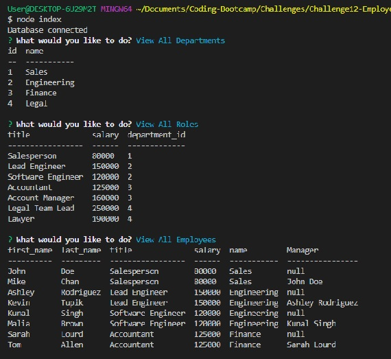
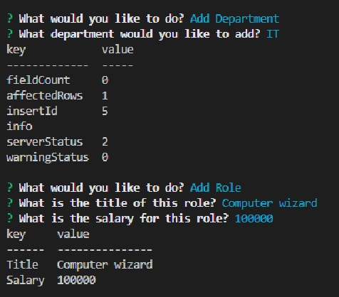

# Employee-Tracker

## Description
This project is a command-line application built to manage a company's employee database, using Node.js, Inquirer, and MySQL.

## Usage
Please refer to the following link to view a video demo to see how the app can be used.
https://drive.google.com/file/d/1y0sIlMK8rnmUBUledcmu1zDoqAP-SpPn/view?usp=sharing

## Screenshot
Below is a screenshot of the command-line prompts as well as the generated HTML rendered in the browser.

## Contributors
This challenge was coded by Sara Barnett.
